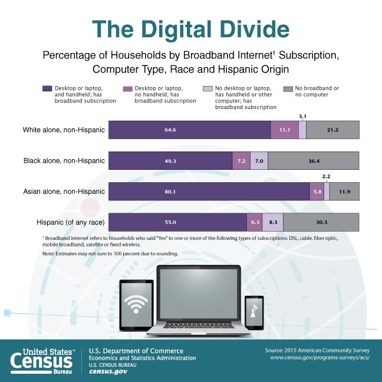

# Decoding the Digital Divide


This project analyzes the impact of the broadband and device digital divide upon educational assessment outcomes for math and reading/language arts in K-12 public School Districts across the United States.

## Repository Navigation


- [DATA:](data)
    - *The root of this folder contains final prepped data**
    - [Census](data/census)
    - [Education](data/education)
    - [Geodata](data/geodata)
    - [Prepped](data/prepped)
    - [Models](data/models)


- [FIGURES:](figures)
    - Saved figures and visualizations used in notebooks/presentation
    - [Feature-Specific Visualizations](figures/features)
    - [Modeling-Specific Visualizations](figures/model_eval)


- [NOTEBOOKS:](notebooks)
	- Notebooks used for analyzing data
   - [Executive Notebook](notebooks/1_Executive_Notebook.ipynb)
   - [Education EDA](notebooks/2_Education_EDA.ipynb)
   - [Geodata EDA](notebooks/2a_geodata_EDA.ipynb)
   - [Census and Education EDA](notebooks/3_Census_and_Education_EDA.ipynb)
   - [MODELS](notebooks/4_Modeling_two_variables.ipynb)
   - [Feature Importances](notebooks/5_feature_importances.ipynb)
    


- [PRESENTATION:](reports)
    - Presentation of Project
	- [Google Slides](https://docs.google.com/presentation/d/1iYtcgCwVniVhh6pzSkWVbSMxSCWfmlexhkF2MNAclnY/edit?usp=sharing)
    - [PDF](reports/decoding_the_digital_divide.pdf)
    - [Powerpoint](reports/decoding_the_digital_divide.pptx)


- [SRC:](src)
    - [Documentation](src/documentation) - Data Dictionaries & Source Docs
    - [Functions](src/functions) - Pickled Functions
    
<!--     - [Python Initilization file]('src/__init__.py')
    - [Script for Data Acquisition]('src/data_acquisition.py')
    - [Script for Data Cleaning]('src/data_cleaning.py')
    - [Script for Visualizations]('src/visualizations.py')
    - [Script for Modeling]('src/modeling.py')
 -->

***

## Readme Navigation


1. [Business Understanding](#Business-Understanding)

2. [Data Understanding](#Data-Understanding)
    1. [Dataset](#Dataset-(Merged))
    2. [Exploratory Data Analysis](#Exploratory-Data-Analysis-(EDA))

3. [Modeling](#Modeling)
    1. [Data Preparation](#Data-Preparation)
    2. [Iteration & Evaluation](#Iteration-&-Evaluation)
    3. [Model Selection](#Model-Selection)
    4. [Feature Importances](#Feature-Importances)


4. [Conclusion](#Conclusion)
    1. [Recommendations](#Recommendations)
    2. [Areas for Growth](#Areas-for-Growth)


5. [Project Info](#Project-Info)

***

# Business Understanding

Across the country (and the world), as the Academic Year  2020-21 begins, the covid19 pandemic is forcing many schools to only reopen virtually. Given the already existing inequalities across the country, especially regarding educational outcomes, this continually deepening digital divide will set some students back more than others. This project therefore creates a model that will predict the impact of device and broadband access upon a composite proficiency percentage  for math and reading / language arts asssessments in K-12 public School Districts across the United States. By extracting the feature importances from this predictive model, stakeholders can understand how important it is to mitigate this solve-able problem by viewing how influential digital access is upon student performance across the nation, as well as assess that impact in individual Local Education Agencies (LEAs). 

The understanding, therefore, is more of a "socio-politial" understanding than a business understanding. Stakeholders vary across the board, but could include:
1. Nonprofits seeking to distribute devices
2. Local governments seeking to allocate financial resources
3. Broadband internet companies seeking to expand
4. Working-From-Home Parents
5. Political Representatives

<p>



</p>

**GOAL: Obtain the importance of the digital divide (broadband and device access) in accurately predicting students' educational assessment scores.**

***

# Data Understanding

The data in this project is a concatenation from several sources:
1. United States Census - American Community Survey (ACS) 5-year Estimates
    - ACS 5yr 2018 Data Profiles
2. United States Census - Small Area Income and Poverty Estimates (SAIPE)
    - SAIPE 2018
3. US Department of Education - National Center for Education Statistics (NCES) Ed*Facts*
    - 2017-18 Assessments - Proficiency Levels

These specific sources allowed for granular analysis down to the School District in order to understand the digital divide on local scales: specifically, down to the Local Education Agency ID (LEAID). 

Instructions for acquiring this specific data from the Census and the NCES are provided explicitly in the notebooks, along with functions for doing so in order to streamline the data acquisition process and facilitate future scaling.


### Dataset (Merged)

The selected data collected from the above 3 sources (ACS, SAIPE, Ed*Facts* were merged to produce one dataset. This complete dataset includes 13,000 public School Districts as observations, features selected for their presumed impact in determining the educational assessment performance, and the   observations include over 13,000 School Districts in the United States. Features were manually selected based on industry knowledge to be used for explainability.,


1. **OBSERVATIONS** - 13,000 School Districts
    1. Unified, Elementary, Secondary School Districts
    2. Indexed by Local Education Agency ID (LEAID)


2. **FEATURES** - 10 from Census (% Estimates, unless noted):
    1. DP05_0037PE - Percent Estimate of Population White
    2. DP02_0066PE - Percent Estimate of Population with Bachelor's degree
    3. DP03_0062E - Median Household Income Estimate (not % Estimate)
    4. DP04_0134E - Median Rent Estimate in Dollars (not % Estimate)
    5. DP03_0009PE - Unemployment Rate
    6. DP02_0112PE - Percent Estimate of Population whose primary home language is not English
    7. DP02_0071PE - Percent Estimate of Population with Disability
    8. DP02_0152PE - Percent Estimate of Population with Broadband access
    9. DP02_0151PE - Percent Estimate of Population with Device access
    10. SAEPOVRAT5_17RV_PT  - Ratio of Children Ages 5-17 living in poverty


3. **TARGET VARIABLES**
    1. Math Assessment (MTH) Proficiency from 2017-18
    2. Reading / Language Arts (RLA) Assessment Proficiency 2017-18


### Data Limitations

- Assessment data outdated - 2017-18; not done in 2020
- Census data limited to what's available at the proper scale
- Census data limited - only questions asked in the census  
    - Other than poverty ratio, data includes ALL households, not just those with children of public school age
- All datasets are limited by the caveats put forth in their respective documentations online, such as small error ranges for the percentage estimates.

***

# Exploratory Data Analysis (EDA)

The initial EDA process was used to determine how to prepare the data for optimal utilization in machine learning models later. Amongst other things, it revealed:

- Formatting issues due to privacy protections (estimation/elimination)
- Feature distributions skewed and on different scales (transformation)
- Feature Correlations (not re-engineered due to the already low quantity)
- Target Variable Correlation (Composite variable engineering)
- Missing data (imputation)


### Formatting: 
The [Education EDA Notebook](notebooks/2_Education_EDA.ipynb) goes into further detail regarding the formatting due to privacy issues. Certain range values were dropped due to their lack of specificity (e.g., Greater than or equal to 50% proficient is not very informative). The increased lack of specificity corresponded with decreased School District sizes, so dropping these features was reasonable. Other values (e.g., GE95, etc.) were engineered as averages. More detail on the methodology can be found in Section 1.5 of the [Ed*Facts* Documentation](src/documentation/assessments-sy2017-18-public-file-documentation.docx) as well.

### Distributions:
<p>


</p>
	
As can be seen in the visualization on the left, these initial distributions had different scales and various skews, so a Box-Cox transformation was applied to smoothen out the data and aid the models in making more effective predictions, as seen on the right. The two digital access features we are most interested in, device access and broadband access, are highlighted in red. 

### Feature Correlations:

The graphic above displays correlations between all the variables, including the target variables, where:
- Dark Green = 100% positive correlation
- Yellow = 0 correlation
- Red = 60% Negative correlation

Ideally, each variable would be in the light orange to light green range, with minimal correlation. Since we only used a few key features in this model, we did not further engineer additional features, though that may be done in the future with further feature selection.


### Target Variable Correlation:


One adjustment that was made from the correlations was the engineering of a "composite" proficiency percentage, which was the average of the math and reading scores. Since the distributions were not exactly the same (with math skewing right - generally lower percentages of students proficient), these target variables could be separated and analyzed in the future for the digital divide impact on them each.


### Missing Data:


Initially, this study focused on only Secondary School Districts; however, the above EDA geographic heat map of math proficiency perecentages revealed that secondary schools were also under the Unified School Districts category as well. So additional data for all 3 district types (Elementary, Unified, Secondary) was acquired to account for this gap. In the future, the data could be bucketed by selecting column ranges for the specific grades desired.

Geographic visualization also demonstrated the gap of missing data from New Mexico (did not file in time) and Virginia (had data collection errors impacting thousands of school districts). For these two states, data was imputed from an earlier year (2016-17) to end with a more complete map. After modeling, it was also discovered that Maryland and Connecticut also had missing data; however, due to time constraints, this data was not imputed and just dropped. In the future, these can be searched for, added, and imputed.

***

# Modeling

More detail can be found in the [Modeling Notebook](notebooks/4_Modeling_two_variables.ipynb). In the modeling phase, we chose to evaluate several regression techniques to predict the composite proficiency score since the data was all continuous. The modeling process included the following steps:

1. Data Preparation
2. Performance Metrics Selection
3. Iteration & Evaluation
4. Model Selection
5. Feature Importance

### Data Preparation

Most of the work in the data preparation phase was captured in the EDA section. These steps included:
- Target Variable Combination (creating a composite proficiency score)
- Removing non-positive values (required for Box-Cox transformation)
- Test, Train, Split (splitting the data into training and test data)
- Data Transformation for Training & Test sets (applying Box-Cox to features in training and test data)

### Performance Metrics Selection

For regression models, the project uses two specific metrics:
1.  **Adjusted R-squared** (0.0000 to 1.0000) - higher is better.
    - the proportional improvement in prediction from the model compared to the mean mode
2. **Root Mean Squared Error (RMSE)** - lower is better.
    - provides model accuracy in terms of target variable units (percentage proficient, in this case)

A function to show these scores was created and is used throughout the modeling process.

## Iteration & Evaluation

Using these metrics, the project iterates through several models, progressing from simple to more complex with the evaluation method including addressing the following:

Further detail is provided in the [Modeling Notebook](notebooks/4_Modeling_two_variables.ipynb), but the project progresses through the following from Linear Regression using ElasticNet CV through Decision Tree and Random Forest Regressors, ending with Gradient Boosting Regressor and XGBoost and selecting the Gradient Boosting Regressor as the best.

### 1. Linear Regression --> ElasticNet CV...

   - Improved upon the "Dummy Regressor" by reducing bias through regularization
   - Increased Adjusted R^2 to .3478, decreased RMSE to 13.54
   - However, model performance peaked, and linear regression could not handle the correlation of feature, rendering some irrelevant, or even worsening the model:

<p> 


</p>


Given the worsening model from the features we're seeking to analyze, and the peaked performance, the next models to evaluate were a Decision Tree and a Random Forest

### 2. ...Decision Tree  --> Random Forest...
Hyperparameter tuning was performed on the Decision Tree Regressor with manual adjustments performing better than a Randomized Search CV on the hyperparameters:

**Decision Tree** Hyperparameters:
- max_depth=20
- min_samples_leaf=100,
- min_samples_split=100,
- Adjusted R^2 Score: 0.36, RMSE: 13.40

However, the Decision Tree Regressor also rendered our digital access features irrelevant as the model performance was outweighed by the poverty ratio:


**Random Forest**

The Random Forest Regressor increases performance by using a forest of trees, instead of a single fine-tuned Decision Tree, to make predictions. Using this regressor improved performance while not rendering our features completely useless.
- n_estimators=200
- max_depth=13
- Adjusted R^2 Score: 0.3949, RMSE: 13.01


### 3. ...Gradient Boosting Tree <-- XG Boost

The last two models tried were a Gradient Boosting Tree and Xtra Gradient Boosting. The Gradient Boosted Tree increases performance by creating a forest of trees by analyzing the errors on previous trees. XGBoost, even with Grid Search Cross-Validation on the hyperparameters, performed worse than the standard gradient boosted tree with the metrics we used, so we won't go into detail on it here. Below we visualize the error rate on the Gradient Boosted Tree regressor.


## Model Selection 

After progressing through more and more complex models, several were developed, and to ensure the best performance, used Cross-Validation on each, with both R-squared and RMSE as the evaluation metrics. After this evaluation, **Gradient Boosting Regressor** (with hyperparameters selected through cross-validation) was selected for the following reasons:

- **Performance** - Highest Adjusted R^2: 0.5132
- **Robustness** - Lowest RMSE as well: 11.67
- **Consistency** - Performed well in cross-validation

This regressor had the following hyperparameters:
- learning_rate = 0.05,
- max_depth = 4,
- n_estimators = 75,
- subsample = 0.8

***
# Feature Importances

Returning to our project goal, since our objective was to understand the impact of the digital divide upon educational performance, simply selecting a model with the best predictive scores was not enough; we needed to understand the contribution of the digital access factors to the educational assessment scores. This was done through feature importances.

Further detail is provided on understanding feature importances in the [Feature Importances Notebook](notebooks/5_feature_importances.ipynb). Generally, feature importances help understand which factors contributed to a model's predictive performance, but how do we measure importance? A few ways to evaluate this:


- Globality (National Model) vs Locality (Local Education Agency)
- Features (Continuous, Ordinal, Categorical)


1. Mean Decrease in Impurity (MDI - sklearn standard)
    - biased towards high cardinality features
    - computed on training set statistics; may not be useful to generalize
2. Permutation Importance
    - evaluates feature importance by determining decrease or increase in model performance without said feature
    - handles categorical variables better
    - adding correlated features decreases their mutual importance
3. **SHAP (SHapley Additive exPlantations)**
    - Based on game theory (game=outcome predictions, player=features)
    - Allows for both global and local interpretations
    - [Interpretable ML Book, 8/24/20](https://christophm.github.io/interpretable-ml-book/shap.html)


While the project analyzes the feature importance through all three, the most relevant to our analysis is the SHAP values. These values make the model more interpretable through their capabilities for **generalization** (e.g., model-agnostic), **localization** (e.g., allows for understanding the feature importance at the School District observation level), and shows exactly **in what direction and how much** our feature contributes.

Thus, rather than using a simplistic **bar chart** to demonstrate feature importances...


...we can get a **BeeSwarm plot** where each individual dot is an observation, and that shows in what direction and to what extent each feature contributes in forming the prediction... 


...as well as view how these features impact a particular district:


Thes charts allowed us to make the following conclusions:
1. Higher poverty ratios decrease performance, 
2. Higher percentage whiteness increased performance, and importantly for us:
3. Higher percentages of **broadband access** produced better assessment proficiencies, and
4. Interestingly, **device access** did not prove as informative in forming the model, though the long blue tail might suggest that lower device access actually increased composite proficiency percentages in those districts... \[Insert your joke about those kids and their phones here\].
***

# Conclusion

Through EDA, Modeling, and Feature Analysis, can make the following conclusions:

1. **Gradient Boosting Tree Regressor** with a learning rate of .05, maximum depth of 4 per tree, 75 trees, and a subsample for evaluating of .8 provided the most accurate model in understanding the impact of the selected 10 features on student assessment outcomes. With just 10 features, the winning model improved the predictive performance (using Adjusted R-squared) by 51.32%.

2. **Broadband Access was the 3rd most important feature** in understanding how the model made its predictions


The impact of broadband access is pretty significant given the importance of other variables in the model like household income, bachelor's degree, unemployment, english as a second language, etc.

## Recommendations

1. Focus on increased **broadband over device** access
2. Use this model to allocate resources more effectively:
    - Where broadband had the highest impact on assessment scores, increase broadband delivery
    - Find and **target school districts** where device access is deemed to be more important with increased device delivery
3. Use this model as a baseline for future analysis, improving with increased information, and perhaps applying time series analysis to monitor and evaluate progress in bridging the divide.


## Areas for Growth

1. **Features**
    - more detailed feature levels from census data (e.g., specific race, levels of education, levels of income)
    - incorporate geography as a feature (e.g. urban / metropolitan vs rural, ordinal)
    - more granular digital access analysis (e.g., broadband speeds, # and type of devices per student in household)
    - address in depth issues like multicollinearity through further feature engineering


2. **Target**
    - Separate math from reading and language arts to create separate models and understand impacts of digital access on each subject separately, instead of just one composite score
    - Analyse in further detail, focusing on grade / school levels specifically.


3. **Model**
    - Update with 2020 Census information
    - Get more relevant / recent school assessment data - 2 years (2018) is forever ago in technology
    - Use Time-Series Analysis to address trends in time and evaluate remedy effectiveness.


# Project Info
<p>

</p>

**Contributor**: __[Alexander Newton](mailto:alexandernewton@gmail.com)__

<a href="https://www.linkedin.com/in/anewt/">
         
      </a>

<a href="https://anewt.medium.com/">
         
      </a>

<a href="https://youtu.be/MX_vj9a5waQ">
         
      </a>

**Languages**  : Python, HTML

**Tools/IDE**  : Git, Command Line (Windows), Anaconda, Jupyter Notebook / Jupyter Lab, Google Slides, Trello, Toggl Track

**Libraries**  : numpy, pandas, matplotlib, seaborn, scikit-learn, statsmodels, shap, yellowbrick, geopandas, plotly, json, requests, re 

**Duration**   : August-September 2020

**Last Update**: 09.30.2020

[Presented on 09.29.2020](https://youtu.be/MX_vj9a5waQ)

```python

```


